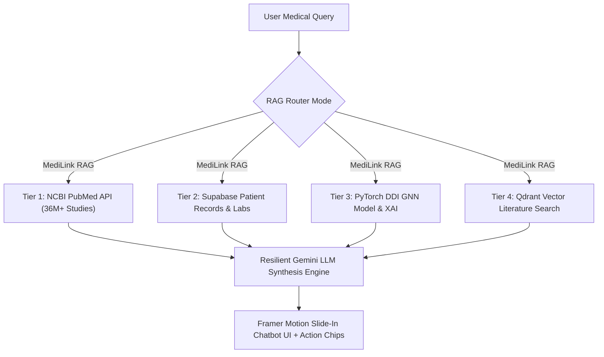

# MediLink AI — Autonomous Healthcare Engine & Medical RAG Platform

MediLink AI is an advanced, privacy-first healthcare platform for health record management, document OCR extraction, patient passport auto-population, and an **Autonomous Multi-Modal Medical RAG & Drug-Drug Interaction (DDI) Safety Engine**.

---

## ✨ Autonomous Medical RAG & Multi-Agent Engine

MediLink AI features a **4-Tier Hybrid RAG Engine** that synthesizes live global scientific research, dynamic patient health records, PyTorch neural interaction models, and vector literature search:



### 🎯 3 Orchestration Modes
1. **`MediLink RAG` (Default Unified Engine)**: Integrates uploaded patient lab parameters, GNN DDI risk logits & XAI explanations, live PubMed study PMIDs, and Qdrant literature search.
2. **`Multi-Agent Triage` (LangGraph Workflow)**: Autonomous LangGraph state graph routing across RAG, Web Search, and Medical Vision Agents (Chest X-Ray, Skin Lesions, Brain MRI).
3. **`Direct RAG` (Qdrant Vector Store)**: Qdrant vector database similarity retrieval + TinyBERT Cross-Encoder reranking.

### 🎨 Framer Motion Interactive Chatbot Drawer
- **Tactile Slide-In Drawer**: Tactile spring physics slide-in drawer (`motion/react`) with backdrop blur.
- **Agentic Tool Execution Stream**: Real-time tool call progress indicators (*Querying PubMed*, *Reading Patient Vault*, *Evaluating GNN Matrix*).
- **Interactive Action Chips**: Auto-generated CTA buttons (`Add "Amlodipine" to Profile`, `Save Allergy`) that dynamically persist records into Supabase `extracted_medical_values`.

---

## 🛠️ Quickstart & Local Setup

### 1. Frontend Setup (React & Vite)

Requires Node.js 18+.

```bash
git clone https://github.com/AryanGusain-dev/MediLink-AI.git
cd MediLink-AI
npm install
npm run dev
```

### 2. Backend Setup (FastAPI & Virtual Environment)

Requires Python 3.11+.

#### Windows (PowerShell):
```powershell
cd backend
python -m venv venv
.\venv\Scripts\Activate.ps1
pip install -r requirements.txt
uvicorn app.main:app --reload --port 8000
```

#### macOS / Linux (Bash / Zsh):
```bash
cd backend
python -m venv venv
source venv/bin/activate
pip install -r requirements.txt
uvicorn app.main:app --reload --port 8000
```

Backend API endpoints and interactive Swagger UI will be available at `http://localhost:8000/docs`.

---

## 🏗️ Technology Stack

- **Frontend**: TanStack Start, React 19, TypeScript, Tailwind CSS v4, Motion (Framer Motion), Lucide Icons, Sonner.
- **Backend API**: FastAPI, Uvicorn, Structlog, Pydantic v2.
- **Machine Learning & XAI**: PyTorch, Autoencoders, Deep Neural Networks, Input $\times$ Gradient Saliency, FastEmbed (BM25), Qdrant Vector Client.
- **Database & Auth**: Supabase Postgres, Row Level Security (RLS), Supabase Storage.
- **LLM Synthesis**: Google Gemini (`gemini-3.5-flash` with automatic fallback to `gemini-3.1-flash-lite`).

---

## 📚 Technical Architecture & Comprehensive Docs

For in-depth mathematical formulas, 4-Tier RAG specifications, PyTorch model training metrics, database schemas, and medical domain knowledge:
👉 **[Technical Architecture & Medical Knowledge Guide](./TECHNICAL_ARCHITECTURE_AND_KNOWLEDGE.md)**

---

## 🧪 Sample Medical Test Documents (`example_medical_docs/`)

The repository includes a realistic **10-document sample medical record suite** in `example_medical_docs/` for trying out OCR extraction, Patient Passport auto-population, and Drug-Drug Interaction (DDI) safety checks without needing to provide personal medical files.

### Master Combined Vault File
- **`example_medical_docs/00_Combined_Medical_Record_Vault.pdf`**: A single 10-page sample PDF containing full patient history across 3 specialist doctors and a pathology laboratory.


### Expected Safety Tagging Matrix

| Drug Combination | Expected Tag | Color Code | Source Engine |
| :--- | :--- | :--- | :--- |
| **Amlodipine + Paracetamol** | `NO INTERACTION` / `SAFE` | 🟢 Green | DDI Database Hit |
| **Metformin + Vitamin C** | `NO INTERACTION` / `SAFE` | 🟢 Green | DDI Database Hit |
| **Amlodipine + Ibuprofen** | `HIGH RISK` | 🔴 Red | `DDI DB Library Hit` |
| **Metformin + Iron** | `MODERATE RISK` | 🟡 Amber | `DDI Model Prediction` |
