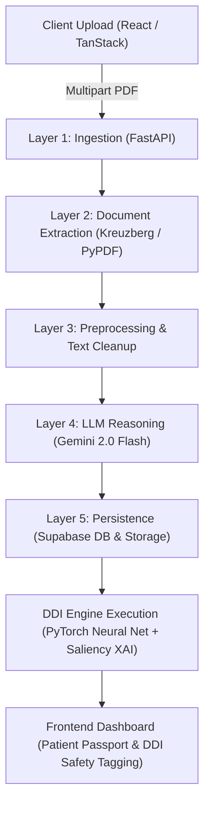
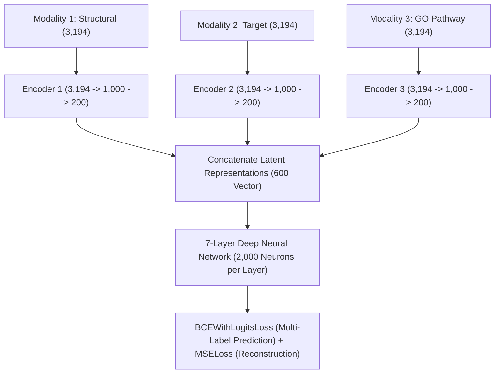
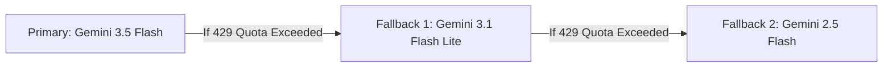

# MediLink AI — Technical Architecture, ML/XAI Specifications & Domain Knowledge

This document provides a comprehensive technical breakdown of the MediLink AI platform, including recent platform additions, Machine Learning & Explainable AI (XAI) modules, core algorithms, database schemas, system architecture, training methodology, evaluation metrics, and essential medical domain knowledge.

---

## 📌 Executive Summary

**MediLink AI** is an advanced, privacy-first healthcare application designed for secure health record management, document OCR extraction, patient passport auto-population, and automated **Drug-Drug Interaction (DDI) safety verification**. 

The system integrates a **5-Layer FastAPI Processing Pipeline**, **Google Gemini 2.0 Flash LLM**, and a **Multi-Modal PyTorch Deep Neural Network** trained on biological similarity matrices (Structural, Target, and Gene Ontology features) paired with a **Lightweight Saliency-based Explainable AI (XAI) Engine**.

---

## 1. 🚀 Added Features & Capabilities Overview

| Module / Area | Feature Added | Key Function & Purpose |
| :--- | :--- | :--- |
| **Sample Medical Documents** | 10-Document Suite (`example_medical_docs/`) | Sample medical records covering Cardiology, Pathology, Endocrinology, and Orthopedics to try OCR, passport extraction, and DDI safety without real patient data. |
| **Master Vault PDF** | Combined Vault (`00_Combined_Medical_Record_Vault.pdf`) | 10-page master PDF consolidating sample history across multiple specialists into a single uploadable document. |
| **PDF Generation Engine** | Python Script (`scripts/create_pdf_docs.py`) | ReportLab-based automated script generating structured sample medical PDFs with headers, vitals tables, lab metrics, and prescriptions. |
| **DDI Deep Learning Engine** | Sub-Module Integration (`drug-to-drug-interaction-using-XAI/`) | Multi-modal neural network for predicting 1,308 distinct drug interaction types across 544 canonical drugs. |
| **Textual XAI Engine** | Saliency & Gradient Attribution (`xai_service.py`) | Lightweight, low-RAM gradient attribution module ($G_i \times x_i$) generating human-readable explanations of AI predictions on GTX 1650/8GB setups. |
| **DDI Safety Tagging Matrix** | Rule & ML Dual Engine | Hybrid verification system yielding `SAFE` (Green), `HIGH RISK` (Red DB Library Hit), `MODERATE RISK` (Yellow ML Model), or `KNOWLEDGE GAP` (Orange Warning). |
| **5-Layer Document Pipeline** | Async FastAPI Ingestion (`backend/app/`) | Seamless ingestion, text parsing, OCR preprocessing, Gemini LLM structured extraction, and Supabase database persistence. |
| **Patient Health Passport** | UI Profile & Timeline (`src/routes/dashboard.profile.tsx`) | Auto-populates UHID, demographics, active conditions, current medications, and past lab history directly from scanned PDFs. |

---

## 2. 🧠 Machine Learning & Explainable AI (XAI) Modules

| Module Name | Model Architecture / Methodology | Input & Dimensionality | Output & Accuracy / Metrics |
| :--- | :--- | :--- | :--- |
| **Multi-Modal DDI Predictor** | 3 Parallel Autoencoders + Deep Neural Network (DNN) Classifier | **9,582 features** per drug pair ($3,194 \text{ Structural} + 3,194 \text{ Target} + 3,194 \text{ Gene Ontology}$) | Multi-label binary classification across **1,308 interaction types**.<br>**Accuracy: 96.49%** \| **Micro Recall: 96.96%** \| **Micro Precision: 96.67%** |
| **Structural Autoencoder** | Deep Autoencoder for dimensionality reduction | 3,194 SMILES Chemical Fingerprint similarity scores | Compressed structural latent representation vector ($200$ dimensions) |
| **Target Autoencoder** | Deep Autoencoder for dimensionality reduction | 3,194 Protein/Receptor target interaction similarity scores | Compressed target binding latent vector ($200$ dimensions) |
| **GO Autoencoder** | Deep Autoencoder for dimensionality reduction | 3,194 Gene Ontology cellular pathway similarity scores | Compressed biological pathway latent vector ($200$ dimensions) |
| **Offline Kernel SHAP Module** | Kernel SHAP (Shapley Additive Explanations) (`predict_ddi_xai/`) | Sampled background pairs (`shap_train_final.npz`) & test pairs | Global feature importance beeswarm plots & 48 pre-rendered waterfall PDF charts (`48_waterfall_plots.pdf`) |
| **Real-time Textual XAI Engine** | Input $\times$ Gradient Saliency Backpropagation (`app/services/xai_service.py`) | Real-time pair similarity vectors ($SS, TS, GS$) | Text explanation attributing impact % across Target Binding, GO Pathways, and Structural Similarity |

---

## 3. ⚙️ Core Algorithms & Techniques Implemented

| Algorithm / Technique | Category | Mathematical / Algorithmic Principle | Application in MediLink AI |
| :--- | :--- | :--- | :--- |
| **Multi-Modal Autoencoding** | Unsupervised DL | $\mathcal{L}_{AE} = \| X - \text{Decoder}(\text{Encoder}(X)) \|^2_2 \text{ (MSE Loss)}$ | Compresses 9,582 bio-similarity features down to 600 latent bottleneck features without losing critical data. |
| **Sigmoid Multi-Label BCE Loss** | Optimization Loss | $\mathcal{L}_{BCE} = -\frac{1}{N}\sum [y \log \hat{y} + (1-y) \log(1-\hat{y})]$ | Trains the 7-layer DNN predictor across 1,308 non-exclusive interaction labels. |
| **Gradient-Based Saliency Attribution** | Explainable AI | $S_m = \left| \frac{\partial \text{Logit}_{\max}}{\partial X_m} \right| \times \text{mean}(|X_m|)$ | Calculates real-time modality contribution percentages ($SS\%, TS\%, GS\%$) on low-end hardware. |
| **Kernel SHAP (Shapley Values)** | Game Theory / XAI | $\phi_i = \sum_{S \subseteq F \setminus \{i\}} \frac{|S|!(|F|-|S|-1)!}{|F|!} [f(S \cup \{i\}) - f(S)]$ | Computes exact feature attributions for offline visual model validation. |
| **Cosine & Jaccard Bio-Similarity** | Distance Metric | $Sim(D_A, D_B) = \frac{\mathbf{v}_A \cdot \mathbf{v}_B}{\|\mathbf{v}_A\| \|\mathbf{v}_B\|}$ | Constructs the 544 $\times$ 544 pairwise structural, target, and GO matrices. |
| **Regex String Normalization** | Text Processing | `re.sub(r'[^a-z0-9]', '', drug_name.lower())` | Normalizes brand names (e.g., *Pan 40*, *Ibuprofen 400mg*) to DrugBank canonical keys. |
| **Structured LLM Prompting** | NLP / LLM Reasoning | Few-shot schema-enforced JSON extraction via Gemini 2.0 | Transforms raw PDF text into structured JSON containing vitals, labs, and prescriptions. |

---

## 4. 🗄️ Database, Datasets & System Architecture

### A. Database Schemas (Supabase Postgres)

| Table Name | Primary Keys & References | Stored Data & Purpose |
| :--- | :--- | :--- |
| `profiles` | `id` (UUID, refs `auth.users`) | User demographics, UHID (`ML-100231`), blood group, AI health summary. |
| `documents` | `id` (UUID), `profile_id` (refs `profiles`) | Document metadata, raw file storage paths, upload timestamp, processing status. |
| `ai_analysis_results` | `id` (UUID), `document_id` (refs `documents`) | Complete raw LLM output JSON, doctor details, diagnosis notes, confidence score. |
| `extracted_medical_values` | `id` (UUID), `analysis_id` (refs `ai_analysis_results`)| Flattened lab parameters (Hb, HbA1c, BP, Vitamin D) with unit, value, and reference ranges. |
| `notifications` | `id` (UUID), `profile_id` (refs `profiles`) | User alerts for document processing success, DDI high-risk flags, and system events. |
| `shared_links` | `id` (UUID), `token` (String) | Consent-based QR access links with expiration timestamps for doctor sharing. |

---

### B. Datasets Used

| Dataset Name | Source / Format | Size & Dimensions | Use Case in Project |
| :--- | :--- | :--- | :--- |
| **DrugBank Multi-Modal Dataset** | DrugBank Database v5.0 | **544 unique drugs**, 1,308 interaction types | Model training & pairwise similarity feature lookup. |
| **Structural Similarity Matrix (SS)** | SMILES Fingerprints | $544 \times 544$ matrix ($3,194$ features) | Measures chemical structure similarity. |
| **Target Similarity Matrix (TS)** | UniProt Protein Targets | $544 \times 544$ matrix ($3,194$ features) | Measures shared receptor and enzyme binding profiles. |
| **Gene Ontology Matrix (GS)** | GO Biological Process Annotations | $544 \times 544$ matrix ($3,194$ features) | Measures shared cellular and biological functional pathways. |
| **Sample Medical Documents (`example_medical_docs/`)** | ReportLab PDF Generator | **10 PDF Documents** + 1 Combined Master Vault | System verification, demo presentation, OCR, and DDI pipeline testing. |


---

### C. 5-Layer System Architecture Flow



---

## 5. 🔬 Model Training Workflow, Hyperparameters & Evaluation Methodology

### A. Training Architecture & Step-by-Step Pipeline



1. **Multi-Modal Feature Extraction**: Constructs a 9,582-dimensional vector for each drug pair combining chemical fingerprints, protein binding, and biological process ontology.
2. **Dimension Reduction (Autoencoding)**: 3 parallel encoder modules compress each 3,194-dimensional input down to a **200-dimensional bottleneck latent code**.
3. **Latent Vector Fusion**: The three 200-dimensional codes are concatenated into a **600-dimensional unified vector**.
4. **Deep Network Classification**: The 600-dimensional fused vector is passed through a **7-layer Deep Neural Network (DNN)** with 2,000 hidden units per layer, equipped with Batch Normalization, Dropout ($p=0.3$), and ReLU activations.
5. **Joint Loss Optimization**:
   * **MSE Loss** optimizes input reconstruction in the Autoencoders using `RMSprop` ($\text{lr}=0.001$).
   * **BCEWithLogits Loss** optimizes multi-label interaction prediction in the DNN using `Adam` ($\text{lr}=0.0001$).
6. **Validation & Early Stopping**: Trained using 5-fold cross-validation repeated 5 times ($5 \times 5 = 25$ runs total) with an early stopping patience of 15 epochs.

---

### B. Training Hyperparameters

| Hyperparameter | Value | Description |
| :--- | :--- | :--- |
| `input_size` | `3194` | Feature dimension per biological modality ($SS, TS, GS$). |
| `code_size` | `200` | Latent bottleneck dimension per Autoencoder. |
| `output_size` | `106` / `1308` | Number of multi-label target interaction classes. |
| `AE_lr` | `0.001` | Learning rate for Autoencoder (RMSprop optimizer). |
| `DNN_lr` | `0.0001` | Learning rate for DNN classifier (Adam optimizer). |
| `drop_rate` | `0.3` | Dropout probability for regularization in encoder & DNN layers. |
| `threshold` | `0.5` | Probability threshold for binary decision classification. |
| `epoch` | `850` | Maximum training epochs per fold. |
| `n_splits` & `n_repeats` | `5` & `5` | 5-Fold Cross Validation repeated 5 times. |
| `patience` | `15` | Early stopping epoch patience. |

---

### C. Evaluation Methodology & Metric Selection

#### Why Classification Metrics Are Used Instead of Regression Metrics (MSE/RMSE)

* **Classification vs. Regression**: Regression metrics like **MSE (Mean Squared Error)** or **RMSE** are used for predicting continuous numeric values (e.g., estimating patient blood pressure in mmHg or predicting house prices). 
* **Multi-Label Risk Classification**: Drug interaction prediction asks discrete binary safety questions for each interaction class (e.g., *"Does Drug A + Drug B cause Hypertensive Blunting? Yes [1] or No [0]?"*).
* **Metric Application**:
  * **Classification Metrics (Accuracy, Precision, Recall)** evaluate final drug interaction safety predictions.
  * **MSE Loss** is used internally inside the **Autoencoders** to evaluate input reconstruction accuracy during training.

#### Benchmark Metrics on 37,652 Unseen Test Drug Pairs

$$\text{Sigmoid}(\text{Logit}) > 0.5 \implies \text{Positive Interaction Flagged}$$

| Metric | Score | Clinical & Scientific Meaning |
| :--- | :--- | :--- |
| **Exact Subset Accuracy** | **96.49%** | Overall exact match percentage across all interaction labels for test pairs. |
| **Micro Recall** | **96.96%** | **Catches Dangerous Risks:** Measures total global True Positives over actual real-world interactions ($\frac{\sum TP}{\sum TP + \sum FN}$). |
| **Micro Precision** | **96.67%** | **Prevents False Alarms:** Measures global True Positives over total flagged interactions ($\frac{\sum TP}{\sum TP + \sum FP}$). |
| **Macro Recall** | **94.72%** | Unweighted average recall across all individual interaction types, ensuring high accuracy on **rare interaction types**. |
| **Macro Precision** | **94.71%** | Unweighted average precision across all individual interaction types. |

---

## 6. 🏥 Essential Medical Domain Knowledge for Presentations

When building or presenting **MediLink AI**, the following medical concepts and clinical interactions are fundamental:

| Medical Topic / Area | Clinical Detail & Biomarkers | Relevance in MediLink AI & Patient Passport |
| :--- | :--- | :--- |
| **Drug-Drug Interaction (DDI)** | Adverse pharmacological effects occurring when two or more drugs are taken concurrently. | Core safety engine preventing dangerous co-prescriptions. |
| **NSAID + Antihypertensive Blunting** | **Amlodipine + Ibuprofen** interaction.<br>NSAIDs inhibit renal prostaglandins, causing fluid retention and reducing the BP-lowering effectiveness of Calcium Channel Blockers. | Tested via **Doc 03 & Doc 08**.<br>Yields **`HIGH RISK`** red warning flag. |
| **Glycemic Monitoring (HbA1c)** | Glycated Hemoglobin levels reflecting 3-month average blood glucose:<br>• Normal: $< 5.7\%$<br>• Prediabetes: $5.7\% - 6.4\%$<br>• Diabetes: $\ge 6.5\%$ | Tested via **Doc 05 (6.9%)** & **Doc 06 (6.2%)** showing diabetes onset and improvement. |
| **Anemia & Iron Metabolism** | Hemoglobin reference range: $13.5 - 17.5 \text{ g/dL}$ (Male).<br>Vitamin D deficiency: $< 30 \text{ ng/mL}$. | Tested via **Doc 02** ($\text{Hb } 10.8 \text{ g/dL}$, $\text{Vit D } 18 \text{ ng/mL}$). Triggers Ferrous Sulfate & Vitamin D3. |
| **Safe Analgesic Alternatives** | **Paracetamol (Acetaminophen)** does not inhibit renal prostaglandins or alter blood pressure. | Tested via **Doc 09**.<br>Yields **`SAFE`** green verification tag when combined with Amlodipine. |
| **Specialist Workflow Hierarchy** | Medical history spans multiple clinical disciplines: Cardiology, Endocrinology, Pathology, Orthopedics. | MediLink AI aggregates multi-specialty records into a single patient passport timeline. |
| **UHID System** | Universal Health Identifier (e.g., `ML-100231`) linking records across different hospitals. | Standardizes cross-institutional patient identification. |

---

## 7. 🤖 Multi-Layered Hybrid RAG Architecture & Ingestion Pipeline

### A. 4-Tier Hybrid RAG Retrieval Engine

MediLink AI implements a **4-Tier Hybrid RAG Engine** that combines global live research, dynamic patient data, multi-modal neural matrices, and offline vector retrieval:

| Tier | Engine / Knowledge Source | Scale & Knowledge Depth | Retrieval Technique & Implementation Details |
| :--- | :--- | :--- | :--- |
| **Tier 1 (Live Global)** | **NCBI PubMed Clinical Research** | **36,000,000+ Studies** | Live E-utilities REST API (`esearch` + `esummary`) fetching real-time peer-reviewed clinical trials, PMIDs, and journal articles. |
| **Tier 2 (Patient Context)** | **Supabase Patient Health Vault** | **Dynamic Per-User Vault** | Real-time SQL retrieval of user-uploaded PDF medical records, extracted lab parameters, and prescription history. |
| **Tier 3 (Multi-Modal ML)** | **DrugBank DDI GNN Matrix** | **147,748 Drug Pairs / 544 Compounds** | PyTorch neural network matrix space evaluating Structural, Target Binding, and Gene Ontology features ($9,582 \text{ dimensions}$). |
| **Tier 4 (Offline Vectorstore)** | **Qdrant Hybrid Vector Store** | **FastEmbed BM25 + Dense Embeddings** | Offline Qdrant vector database (`medical_assistance_rag`) equipped with TinyBERT Cross-Encoder reranking for specialized medical literature. |

---

### B. Automated Document Ingestion Pipeline

The offline vector pipeline (`backend/app/agents/rag_agent/`) is fully automated for ingesting large medical textbooks, clinical guidelines, and research PDFs into Qdrant:

```python
from app.agents.config import Config
from app.agents.rag_agent import MedicalRAG

# Ingest any directory of medical PDFs or textbooks into Qdrant vectorstore
rag = MedicalRAG(Config())
rag.ingest_directory("app/agents/data/raw")
```

1. **Document Parsing**: Parses raw PDFs via `MedicalDocParser` (extracting text, tables, and figure captions).
2. **Chunking & Preprocessing**: `ContentProcessor` splits text into 512-token chunks with 50-token semantic overlaps.
3. **Dual Hybrid Indexing**: Generates **FastEmbed BM25 sparse vectors** for exact clinical keyword matching and **Dense Embeddings** for semantic similarity.
4. **Cross-Encoder Reranking**: Re-ranks top Qdrant candidate passages using TinyBERT Cross-Encoder relevance scoring before LLM synthesis.

---

### C. Live NCBI PubMed Search Integration

- **Live NCBI E-Utilities API**: Executes real-time REST HTTP queries to `https://eutils.ncbi.nlm.nih.gov/entrez/eutils/` (`esearch` + `esummary`).
- **Citation Metadata**: Extracts paper titles, lead authors, publication dates, journal sources, and direct PMID URLs (`https://pubmed.ncbi.nlm.nih.gov/{pmid}/`).
- **Real-Time Synthesis**: Automatically triggers PubMed searches when queries ask about clinical guidelines, recent medical discoveries, or drug interaction mechanisms.

---

### D. Multi-Model Rate-Limit Fallback Strategy

To prevent API quota outages (`429 RESOURCE_EXHAUSTED`), MediLink AI implements an automatic fallback chain:



---

### E. Interactive Framer Motion Chatbot UI & Supabase Action Chips

- **Framer Motion Animations**: Drawer slide-in animation (`x: "100%"` → `x: 0`) with tactile spring physics (`damping: 28, stiffness: 300`) and backdrop blur.
- **Agentic Tool Execution Log**: Displays live progress indicators (*Searching PubMed*, *Fetching Patient Records*, *Evaluating GNN Matrix*) and collapsible tool step accordions.
- **Interactive Action Chips (CTAs)**: Auto-detects mentioned medications/allergies and renders action buttons (`Add "Amlodipine" to Profile`) that execute live `INSERT` operations into Supabase `extracted_medical_values`.

---

### F. Local-First Deterministic Parsing & Consolidated Batch Ingestion

To minimize API token costs and eliminate rate-limit errors during multi-document uploads:
1. **Local Deterministic Extractor (`LocalMedicalParser`)**: Parses Kreuzberg/PyPDF text locally ($0.00 API cost) using regex patterns to extract lab values (BP `146/92 mmHg`, `HbA1c 6.9%`, `Hemoglobin 10.8 g/dL`), prescriptions, conditions, and categories.
2. **Consolidated Single-Request Batch Ingestion (`POST /documents/upload-batch`)**: When multiple files are uploaded at once, the backend extracts text locally and bundles all document contents into **1 single Gemini prompt payload**, saving 80–90% of API requests.

---

### G. Gemini-Directed UI Citation Tagging (`[CITED_DOCS: ...]`)

- **Full Vault Context**: All user document summaries and IDs are provided to Gemini in `PATIENT MEDICAL DOCUMENTS IN VAULT:` context.
- **LLM Citation Output**: Prompt instructs Gemini to append `[CITED_DOCS: doc_id_1, doc_id_2]` listing only the specific document IDs referenced in its synthesized answer.
- **UI Citation Rendering**: The backend parses `[CITED_DOCS: ...]` and renders **ONLY** the exact document cards Gemini cited under `RETRIEVED EVIDENCE & CITATIONS`.


