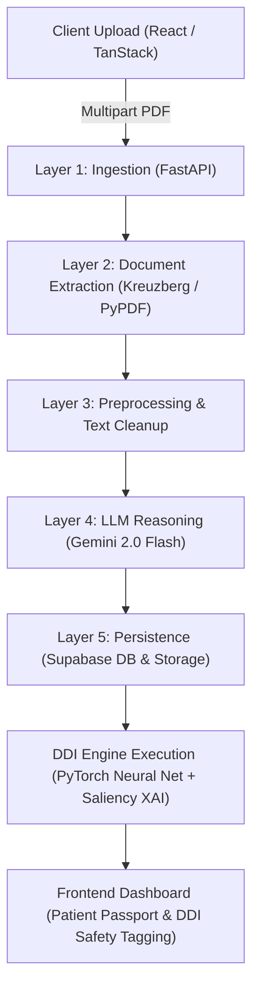

# MediLink AI — Technical Architecture, ML/XAI Specifications & Domain Knowledge

This document provides a comprehensive technical breakdown of the MediLink AI platform, including recent platform additions, Machine Learning & Explainable AI (XAI) modules, core algorithms, database schemas, system architecture, and essential medical domain knowledge.

---

## 📌 Executive Summary

**MediLink AI** is an advanced, privacy-first healthcare application designed for secure health record management, document OCR extraction, patient passport auto-population, and automated **Drug-Drug Interaction (DDI) safety verification**. 

The system integrates a **5-Layer FastAPI Processing Pipeline**, **Google Gemini 2.0 Flash LLM**, and a **Multi-Modal PyTorch Deep Neural Network** trained on biological similarity matrices (Structural, Target, and Gene Ontology features) paired with a **Lightweight Saliency-based Explainable AI (XAI) Engine**.

---

## 1. 🚀 Added Features & Capabilities Overview

| Module / Area | Feature Added | Key Function & Purpose |
| :--- | :--- | :--- |
| **Synthetic Medical Suite** | 10-Document Test Suite (`med_docs/`) | Realistic synthetic medical records covering Cardiology, Pathology, Endocrinology, and Orthopedics to test OCR, passport extraction, and DDI safety without real patient data. |
| **Master Vault PDF** | Combined Vault (`00_Combined_Medical_Record_Vault.pdf`) | 10-page master PDF consolidating patient history across multiple specialists into a single uploadable document. |
| **PDF Generation Engine** | Python Script (`scripts/create_pdf_docs.py`) | ReportLab-based automated script generating structured medical PDFs with headers, vitals tables, lab metrics, and prescriptions. |
| **DDI Deep Learning Engine** | Sub-Module Integration (`drug-to-drug-interaction-using-XAI/`) | Multi-modal neural network for predicting 1,308 distinct drug interaction types across 544 canonical drugs. |
| **Textual XAI Engine** | Saliency & Gradient Attribution (`xai_service.py`) | Lightweight, low-RAM gradient attribution module ($G_i \times x_i$) generating human-readable explanations of AI predictions on GTX 1650/8GB setups. |
| **DDI Safety Tagging Matrix** | Rule & ML Dual Engine | Hybrid verification system yielding `SAFE` (Green), `HIGH RISK` (Red DB Library Hit), `MODERATE RISK` (Yellow ML Model), or `KNOWLEDGE GAP` (Orange Warning). |
| **5-Layer Document Pipeline** | Async FastAPI Ingestion (`backend/app/`) | Seamless ingestion, text parsing, OCR preprocessing, Gemini LLM structured extraction, and Supabase database persistence. |
| **Patient Health Passport** | UI Profile & Timeline (`src/routes/dashboard.profile.tsx`) | Auto-populates UHID, demographics, active conditions, current medications, and past lab history directly from scanned PDFs. |

---

## 2. 🧠 Machine Learning & Explainable AI (XAI) Modules

| Module Name | Model Architecture / Methodology | Input & Dimensionality | Output & Accuracy / Metrics |
| :--- | :--- | :--- | :--- |
| **Multi-Modal DDI Predictor** | 3 Parallel Autoencoders + Deep Neural Network (DNN) Classifier | **9,582 features** per drug pair ($3,194 \text{ Structural} + 3,194 \text{ Target} + 3,194 \text{ Gene Ontology}$) | Multi-label binary classification across **1,308 interaction types**. **Accuracy: 96.49%** \| **Micro Recall: 96.96%** \| **Micro Precision: 96.67%** |
| **Structural Autoencoder** | Deep Autoencoder for dimensionality reduction | 3,194 SMILES Chemical Fingerprint similarity scores | Compressed structural latent representation vector |
| **Target Autoencoder** | Deep Autoencoder for dimensionality reduction | 3,194 Protein/Receptor target interaction similarity scores | Compressed target binding latent vector |
| **GO Autoencoder** | Deep Autoencoder for dimensionality reduction | 3,194 Gene Ontology cellular pathway similarity scores | Compressed biological pathway latent vector |
| **Offline Kernel SHAP Module** | Kernel SHAP (Shapley Additive Explanations) (`predict_ddi_xai/`) | Sampled background pairs (`shap_train_final.npz`) & test pairs | Global feature importance beeswarm plots & 48 pre-rendered waterfall PDF charts (`48_waterfall_plots.pdf`) |
| **Real-time Textual XAI Engine** | Input $\times$ Gradient Saliency Backpropagation (`app/services/xai_service.py`) | Real-time pair similarity vectors ($SS, TS, GS$) | Text explanation attributing impact % across Target Binding, GO Pathways, and Structural Similarity |

---

## 3. ⚙️ Core Algorithms & Techniques Implemented

| Algorithm / Technique | Category | Mathematical / Algorithmic Principle | Application in MediLink AI |
| :--- | :--- | :--- | :--- |
| **Multi-Modal Dimensionality Reduction** | Unsupervised DL | $\mathcal{L}_{AE} = \| X - \text{Decoder}(\text{Encoder}(X)) \|^2_2$ | Compresses 9,582 bio-similarity features into low-dimensional representations. |
| **Sigmoid Multi-Label Binary Cross-Entropy** | Optimization Loss | $\mathcal{L}_{BCE} = -\frac{1}{N}\sum [y \log \hat{y} + (1-y) \log(1-\hat{y})]$ | Trains the DNN predictor across 1,308 non-exclusive interaction labels. |
| **Gradient-Based Saliency Attribution** | Explainable AI | $S_m = \left| \frac{\partial \text{Logit}_{\max}}{\partial X_m} \right| \times \text{mean}(|X_m|)$ | Calculates modality contribution percentages ($SS\%, TS\%, GS\%$) on low-end hardware. |
| **Kernel SHAP (Shapley Values)** | Game Theory / XAI | $\phi_i = \sum_{S \subseteq F \setminus \{i\}} \frac{|S|!(|F|-|S|-1)!}{|F|!} [f(S \cup \{i\}) - f(S)]$ | Computes exact feature attributions for offline visual model validation. |
| **Cosine & Jaccard Bio-Similarity** | Distance Metric | $Sim(D_A, D_B) = \frac{\mathbf{v}_A \cdot \mathbf{v}_B}{\|\mathbf{v}_A\| \|\mathbf{v}_B\|}$ | Constructs the 544 $\times$ 544 pairwise structural, target, and GO matrices. |
| **Regex & Canonical String Normalization** | Text Processing | `re.sub(r'[^a-z0-9]', '', drug_name.lower())` | Normalizes brand names (e.g., *Pan 40*, *Ibuprofen 400mg*) to DrugBank canonical keys. |
| **Structured LLM Extraction Prompting** | NLP / LLM Reasoning | Few-shot schema-enforced JSON extraction via Gemini 2.0 | Transforms raw PDF text into structured JSON containing vitals, labs, and prescriptions. |

---

## 4. 🗄️ Database, Datasets & System Architecture

### A. Database Schemas (Supabase Postgres)

| Table Name | Primary Keys & References | Stored Data & Purpose |
| :--- | :--- | :--- |
| `profiles` | `id` (UUID, refs `auth.users`) | User demographics, UHID (`ML-100231`), blood group, AI health summary. |
| `documents` | `id` (UUID), `profile_id` (refs `profiles`) | Document metadata, raw file storage paths, upload timestamp, processing status. |
| `ai_analysis_results` | `id` (UUID), `document_id` (refs `documents`) | Complete raw LLM output JSON, doctor details, diagnosis notes, confidence score. |
| `extracted_medical_values` | `id` (UUID), `analysis_id` (refs `ai_analysis_results`)| Flattened lab parameters (Hb, HbA1c, BP, Vitamin D) with unit, value, and reference ranges. |
| `notifications` | `id` (UUID), `profile_id` (refs `profiles`) | User alerts for document processing success, DDI high-risk flags, and system events. |
| `shared_links` | `id` (UUID), `token` (String) | Consent-based QR access links with expiration timestamps for doctor sharing. |

---

### B. Datasets Used

| Dataset Name | Source / Format | Size & Dimensions | Use Case in Project |
| :--- | :--- | :--- | :--- |
| **DrugBank Multi-Modal Dataset** | DrugBank Database v5.0 | **544 unique drugs**, 1,308 interaction types | Model training & pairwise similarity feature lookup. |
| **Structural Similarity Matrix (SS)** | SMILES Fingerprints | $544 \times 544$ matrix ($3,194$ features) | Measures chemical structure similarity. |
| **Target Similarity Matrix (TS)** | UniProt Protein Targets | $544 \times 544$ matrix ($3,194$ features) | Measures shared receptor and enzyme binding profiles. |
| **Gene Ontology Matrix (GS)** | GO Biological Process Annotations | $544 \times 544$ matrix ($3,194$ features) | Measures shared cellular and biological functional pathways. |
| **Synthetic Test Suite (`med_docs`)** | ReportLab PDF Generator | **10 PDF Documents** + 1 Combined Master Vault | System verification, demo presentation, OCR, and DDI pipeline testing. |

---

### C. 5-Layer System Architecture Flow

---

## 5. 🏥 Essential Medical Domain Knowledge for Presentations

When building or presenting **MediLink AI**, the following medical concepts and clinical interactions are fundamental:

| Medical Topic / Area | Clinical Detail & Biomarkers | Relevance in MediLink AI & Patient Passport |
| :--- | :--- | :--- |
| **Drug-Drug Interaction (DDI)** | Adverse pharmacological effects occurring when two or more drugs are taken concurrently. | Core safety engine preventing dangerous co-prescriptions. |
| **NSAID + Antihypertensive Blunting** | **Amlodipine + Ibuprofen** interaction. NSAIDs inhibit renal prostaglandins, causing fluid retention and reducing the BP-lowering effectiveness of Calcium Channel Blockers. | Tested via **Doc 03 & Doc 08**. Yields **`HIGH RISK`** red warning flag. |
| **Glycemic Monitoring (HbA1c)** | Glycated Hemoglobin levels reflecting 3-month average blood glucose: • Normal: $< 5.7\%$ • Prediabetes: $5.7\% - 6.4\%$ • Diabetes: $\ge 6.5\%$ | Tested via **Doc 05 (6.9%)** & **Doc 06 (6.2%)** showing diabetes onset and improvement. |
| **Anemia & Iron Metabolism** | Hemoglobin reference range: $13.5 - 17.5 \text{ g/dL}$ (Male). Vitamin D deficiency: $< 30 \text{ ng/mL}$. | Tested via **Doc 02** ($\text{Hb } 10.8 \text{ g/dL}$, $\text{Vit D } 18 \text{ ng/mL}$). Triggers Ferrous Sulfate & Vitamin D3. |
| **Safe Analgesic Alternatives** | **Paracetamol (Acetaminophen)** does not inhibit renal prostaglandins or alter blood pressure. | Tested via **Doc 09**. Yields **`SAFE`** green verification tag when combined with Amlodipine. |
| **Specialist Workflow Hierarchy** | Medical history spans multiple clinical disciplines: Cardiology, Endocrinology, Pathology, Orthopedics. | MediLink AI aggregates multi-specialty records into a single patient passport timeline. |
| **UHID System** | Universal Health Identifier (e.g., `ML-100231`) linking records across different hospitals. | Standardizes cross-institutional patient identification. |

---
